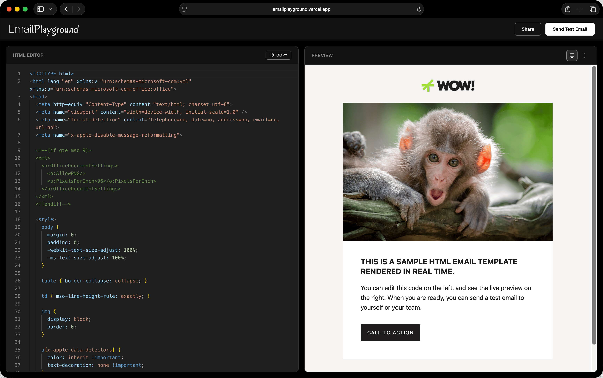

# Email Playground



A fast, minimal tool for building and testing HTML email templates. Write HTML on the left, see the rendered email on the right, and send a test email to your inbox — all from one screen.

## Features

- Monaco-powered editor with Emmet support
- Instant live preview with mobile/desktop toggle
- Send test emails to any address
- Save and share templates with a unique URL
- Resizable split-pane layout

## Setup

1. Clone the repo and install dependencies:

   ```bash
   git clone https://github.com/nsaicharan/email-playground.git
   cd email-playground
   npm install
   ```

2. Copy `.env.example` to `.env.local` and fill in your SMTP and database credentials:

   ```bash
   cp .env.example .env.local
   ```

3. Start the dev server:

   ```bash
   npm run dev
   ```

Open [localhost:3000](http://localhost:3000) and start building.

## Built with

Next.js · Tailwind CSS · Monaco Editor · Nodemailer · PostgreSQL (Supabase)
